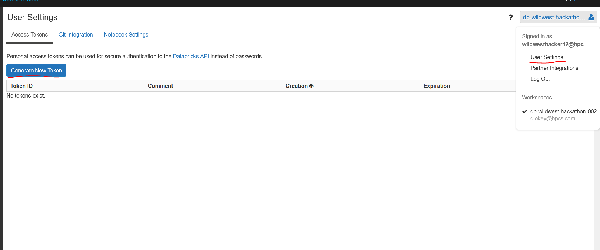

# Wild-West-Hackathon-Best-Of-AI
Wild West Hackathon v2 - using databricks, mflow and azure devops to build automated deployment of fraud detection machine learning models

## Hackathon Challenge Brief

Welcome to Quest #3 of Challenge 2.

This notebook will comprise all of Quest #3. We suggest that your steps should be data exploration, planning, write algorithm, apply algorithm, and finally business explanation. If you are not completely confident after researching, we also suggest that once you have a plan of attack to complete the quest that you send us you plan. We can help fill in the gaps.

The Adventure Works executive and finance teams have had some unexpected financial results. They suspect foul play! You have been hired to find examples of fraud and report when it happens in real-time.

1) Adventure works only receives a total charge for each customer order from each rep. This is because the reps have the freedom to give discretionary discounts to customers if they think it will sway them to but product. The executive team thinks that there is rampant fraud amoung the reps. They suspect that the reps are adding items to a customers order and then taking that item home with them. Adventure works needs you to establish a pattern in finding this behavior then compile a list, moving forward, of fraud examples.

2) Adventure Works let go of their systems administrator a few years back. The systems admin was very unhappy with this and the executive team heard from a co-worker that the sys admin is a known hacker. The executive team is scared that the sys admin left something behind in the system. If you can find the discrepancy in real time then it will be easier for engineers to track down the hack.

Note there exists only two types of fraud present in the data following the scenario above should make them very evident.

This quest entails identifying the fraud trends and writing an algorithm to find fraud in real time.

You will be judged by accuracy in finding real-time fraud, as well as your business explanation.


## Initial Setup to connect VS Code to Databricks Env


### Create Token


### Set up databricks cli
```
    databricks configure --token --profile hackathon-v2
```

### View workspace
```
    databricks workspace list --profile hackathon-v2
```

### Export current notebooks
```
    ./export_notebooks.sh
```

